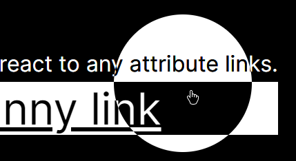
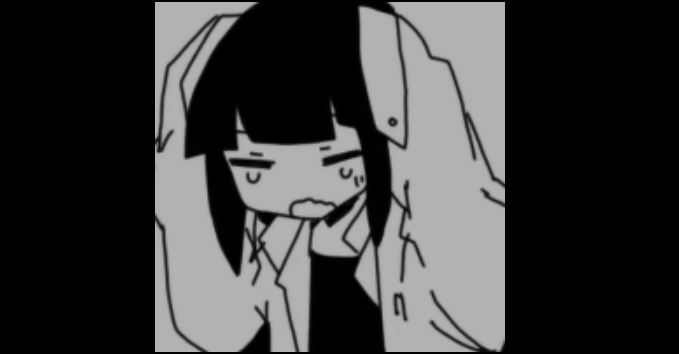

# OrbCursor
## **OrbCursor is portable**
You can directly copy and paste it to your webdev project if you feel like wanting to look fancy and all.

OrbCursor will follow your cursor relative to your viewport (ABSOLUTE), so when scrolling the orb will not get left behind.  
  

---
## **OrbCursor will react:**
- if the cursor is on the web page or not.
- react to any attribute links.  
  
- Optionally you can assign a specific element for the Orb to react in the js. In this example, the element is given data: `orbReact = "true"`  
  
###### `image of Inabakumori`

**OrbCursor has inversion filter embedded in the CSS, no visibility issues.**

---
##### *(not recommended)*
If you want to hide the cursor entirely, change the easing multiplier to 1 in the js.
```js
var speed = 1
```
This minimizes the potential to make the user experience feel jarring.